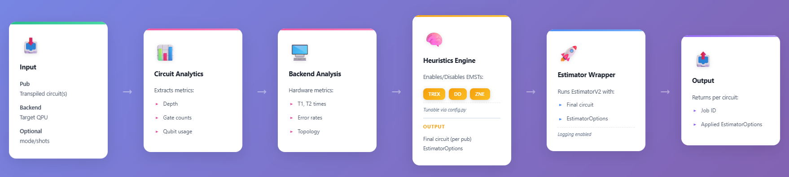

# Adaptive Error Mitigation Framework for Quantum Circuits

> Adaptive Error Mitigation framework developed as part of **IBM Qiskit Advocate Mentorship Program (QAMP) 2025** – [Project #15](https://github.com/qiskit-advocate/qamp-2025/issues/15)

An **intelligent, circuit-aware framework** that eliminates guesswork in quantum error mitigation. Unlike standard resilience levels with fixed strategies, this framework dynamically analyzes post-transpiled circuits and real-time backend noise profiles to automatically select and apply optimal Error Mitigation and Suppression Techniques (EMST).

---

## 🧠 High-Level Workflow



---

## 📂 Repository Structure

```text
adaptive_error_mitigation/
│
├── analytics/           # Circuit and backend analysis modules
├── deliverables/         # Final report and presentation (QAMP 2025)
├── mitigation/          # Pluggable mitigation strategies and selection logic
├── primitives/          # Adaptive execution primitives
├── utils/               # Helper utilities (I/O, metrics, logging, formatting)
├── examples/            # Jupyter notebooks demonstrating usage
├── config.py            # Global configuration & thresholds
├── requirements.txt     # Python dependencies
└── README.md
```

### Key Modules

- **`analytics/`** – Backend noise characterization, circuit feature extraction, noise sensitivity analysis
- **`mitigation/`** – Strategy implementations and adaptive selection heuristics
- **`primitives/`** – Custom estimator primitive for adaptive execution
- **`utils/`** – Formatting & metrics computation

---

## 📚 Examples

### 1️⃣ `SingleJob_GHZEcho.ipynb`

- Single-job adaptive mitigation flow of GHZ echo circuits

### 2️⃣ `AE_Batch_EffSU2_echo_Ex_4.ipynb`

- Batch execution of parameterized EfficientSU2 circuits

---

## ⚙️ Installation

```bash
# Clone the repository
git clone https://github.com/KurianUthuppu/adaptive_error_mitigation.git
cd adaptive_error_mitigation

# (Optional) Create a virtual environment
python -m venv .qcenv
source .qcenv/bin/activate   # Linux / Mac
.qcenv\Scripts\activate      # Windows

# Install dependencies
pip install -r requirements.txt
```

---

## 🚀 Quick Start

```python
from adaptive_error_mitigation import AdaptiveEstimator

# Initialize adaptive estimator with your backend
ae_results = adaptive_estimator.run([pub], backend=backend)

# Retrieving the job_id
job_id = ae_results[0]["job"].job_id()
print(f"Job-Id: {job_id}")

# Retrieving the set estimator options
est_options = ae_results[0]["est_options"]
est_options
```

> **📓 Note:** See `examples/` notebooks for complete end-to-end workflows

---

## ⚠️ Current Limitations

**Available Error Mitigation Techniques:**

- Currently supports **TREX** (Twirled Readout Error Extinction), **DD** (Dynamical Decoupling), and **ZNE** (Zero Noise Extrapolation) only

**Execution Requirements:**

- Supports **single-job**, **batch mode** and **session mode** execution
- Requires **transpiled circuits** for **real backend only** (simulator execution not currently supported)

---

## 📖 Technical Deep Dive

For a detailed explanation of the design decisions, architecture, and adaptive strategy behind this framework, read the full blog:

👉 [**Beyond the Guesswork: Building an Adaptive Error Mitigation Framework for Quantum Circuits**](https://medium.com/@kurianuthuppu11/beyond-the-guesswork-building-an-adaptive-error-mitigation-framework-for-quantum-circuits-e67427866de6)

---

## 📦 Deliverables

- [Final Report (DOCX)](deliverables/FINAL_REPORT_Adaptive_Estimator_QAMP_2025.docx)
- [Final Presentation (PPTX)](deliverables/Adaptive%20Error%20Mitigation%20Framework%20for%20Quantum%20Circuits.pptx)

---

## 🙌 Acknowledgements

**Program:** IBM Qiskit Advocate Mentorship Program (QAMP) 2025

**QAMP 2025 Coordinators:**

- **Dr. Radha Pyari Sandhir** – Workforce & Education, IBM Quantum
- **Astri Cornish** – Workforce & Education, IBM Quantum

**Team Members:**

- **[Aashay Pandharpatte](https://github.com/recursion2612)** – Knowledge Associate, CDAC Pune, India
- **[Kurian Uthuppu](https://github.com/KurianUthuppu/)** – Senior Project Manager, Tecnotree Convergence Pvt Ltd., Bengaluru, India
- **[Shreyansh Agarwal](https://github.com/Shreyansh9878)** – Prefinal Year Physics Student, IIT Jodhpur, India

**Mentor:**

- **[Dikshant Dulal](https://github.com/DikshantDulal)** – Founder & Director, ISAAQ, Singapore

**Powered by:**

- IBM Quantum
- Qiskit

---
